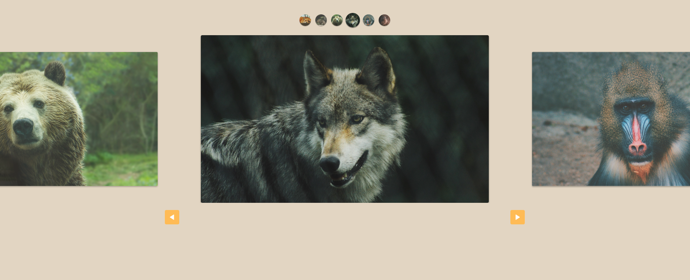

# Slide - Projeto do Curso de JavaScript

Um projeto de slide interativo desenvolvido para o Curso de JavaScript. Este projeto demonstra conceitos básicos de manipulação do DOM, transições e interatividade utilizando HTML, CSS e JavaScript.

## Captura de Tela



## Funcionalidades

<li>Navegação entre slides: Permite avançar e retroceder entre diferentes slides.</li>
<li>Transições suaves: Animações de transição entre os slides para melhorar a experiência do usuário.</li>
<li>Design responsivo: Layout adaptado para diferentes tamanhos de tela.</li>
<li>Fácil integração: Código modular e organizado para facilitar modificações e expansões.</li>

## Instalação e Execução

<h3> Execute no terminal:</h3>

```sh
git clone https://github.com/AkiroSetonai/Slide.git
```

<h3> Acesse o Diretório do Projeto: </h3>
```sh
cd Slide
```
<h3>Abra o arquivo index.html no seu navegador</h3>
